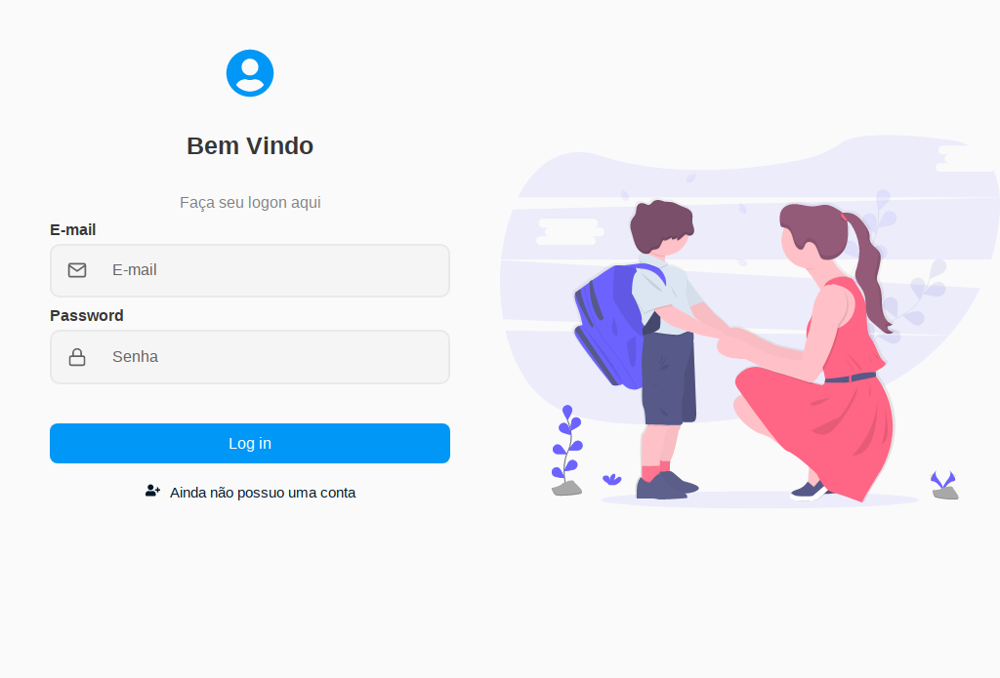
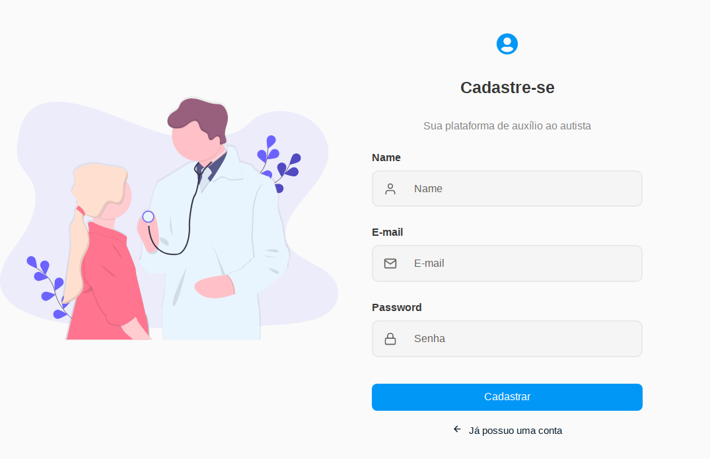
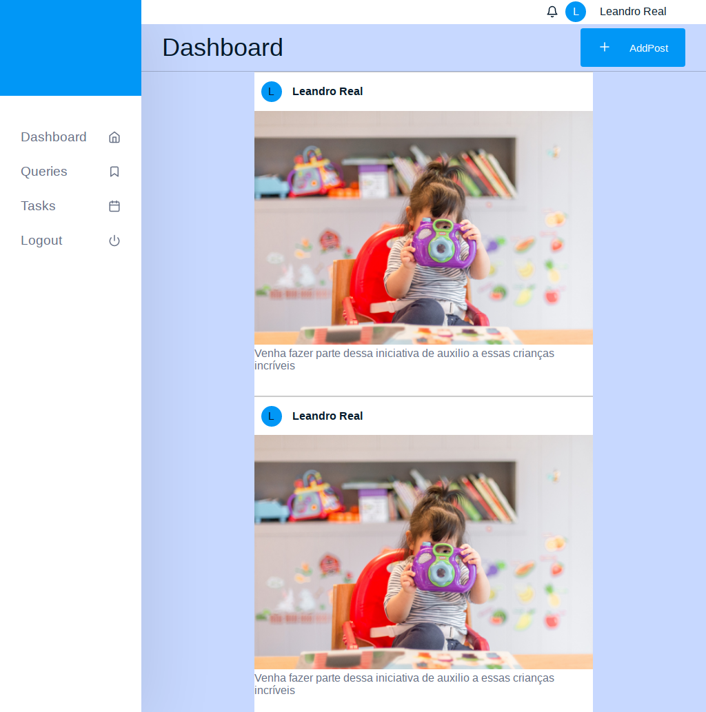
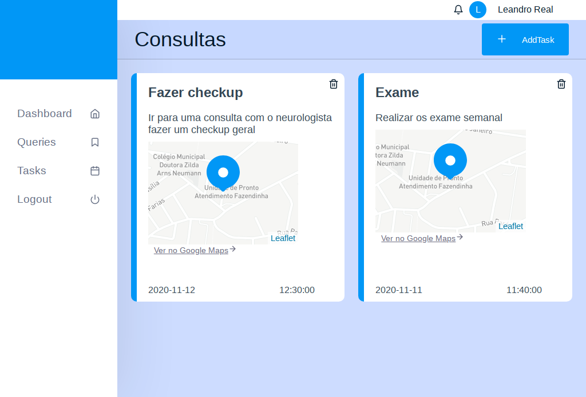
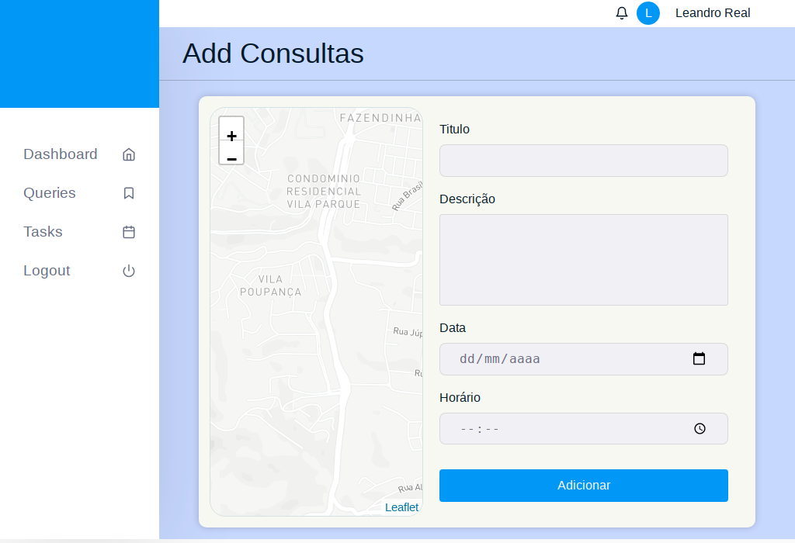
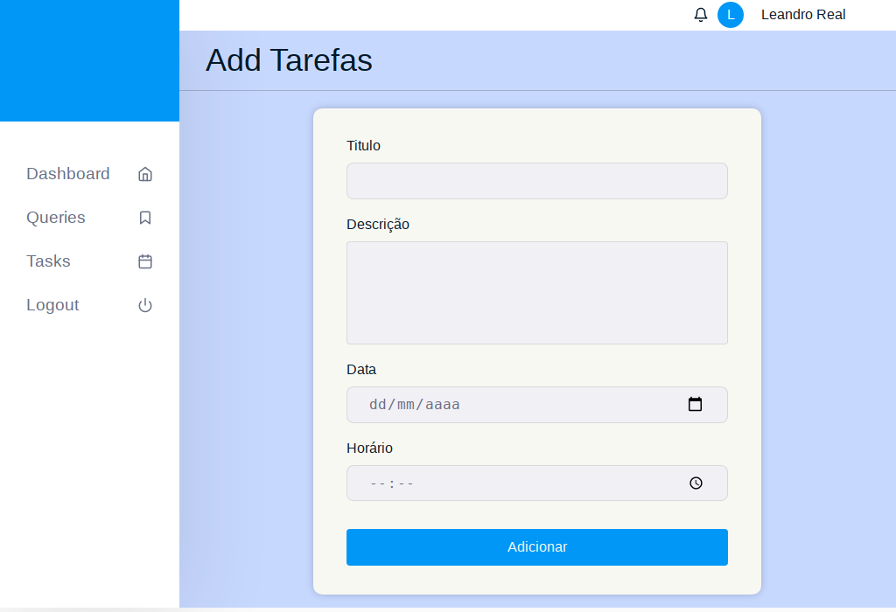
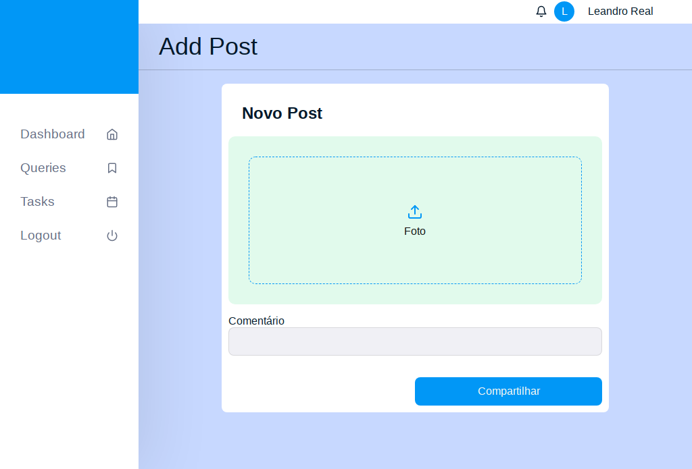

<h1 align="center">Autistic Friends</h1>
<h2 title="Páginas">📌 Sobre</h2>
<p align="left">
Aplicação desenvolvida com a objeção de integrar pessoas com TEA(Síndrome do Espectro Autista) ao mundo digital, ao ingressarem na plataforma os usuários podem marcar seus compromissos de rotina, tarefas diárias e também suas consultas com neurologistas afim de ter um cronograma de acesso dinâmico.
Ela também poderá fazer postagens tornando o seus estilo de vida público a outros usuários pertencentes a esse nicho especifico de pessoas
</p>

<h4 align="center">
🚧 Concluídos 🚧
</h4>
<h2>Web Pages</h2>
<h4>Logon</h4>
<p align="left">
      
</p>
<h4>Register</h4>
<p align="left">
      
</p>
<h4>Dashboard</h4>
<p align="left">
      
</p>
<h4>Queries</h4>
<p align="left">
      
</p>
<h4>Tasks</h4>
<p align="left">
      
</p>
<h4>Add Querie</h4>
<p align="left">
      
</p>
<h4>Add Task</h4>
<p align="left">
      
</p>
<h4>Add Post</h4>
<p align="left">
      
</p>
<br>

## 📋 Como executar o projeto

Este projeto é divido em três partes:
1. Backend (diretório server) 
2. Frontend (diretório web)

💡O Frontend precisa que o Backend esteja sendo executado para funcionar corretamente.

### Pré-requisitos

Antes de começar, você vai precisar ter instalado em sua máquina as seguintes ferramentas:
[Git](https://git-scm.com), [Node.js](https://nodejs.org/en/). 
Além disto é bom ter um editor para trabalhar com o código como [VSCode](https://code.visualstudio.com/)

#### 🎲 Rodando o Backend (servidor)

```bash

# Clone este repositório
$ git clone git@github.com:Leandro2585/AutisticFriends.git

# Acesse a pasta do projeto no terminal/cmd
$ cd AutisticFriends

# Vá para a pasta server
$ cd server

# Instale as dependências
$ npm install

# Acesse o seu MySql pelo terminal com o comando
$ mysql -u root -p

# Crie a base de dados digitando
$ create database amigos_do_autista;

# Saia do MySql
$ exit;

# Execute a aplicação em modo de desenvolvimento
$ npm run dev:server

# O servidor inciará na porta:3333 - acesse http://localhost:3333 

```


#### 🧭 Rodando a aplicação web (Frontend)

```bash

# Clone este repositório
$ git clone git@github.com:Leandro2585/AutisticFriends.git

# Acesse a pasta do projeto no seu terminal/cmd
$ cd AutisticFriends

# Vá para a pasta da aplicação Front End
$ cd web

# Instale as dependências
$ npm install

# Execute a aplicação em modo de desenvolvimento
$ npm run start

# A aplicação será aberta na porta:3000 - acesse http://localhost:3000

```

---

## ⚙️ Funcionalidades

- [x] Cadastro de usuário;<br>
- [x] Login do usuário;<br>
- [x] Agendamento de tarefas;<br>
- [x] Agendamento de consultas;<br>
- [x] Adicionar postagem(foto e comentário);<br>
- [x] Listagem dos posts;<br>
- [x] Listagem das tarefas;<br>
- [x] Listagem das consultas;<br>


## 🛠 Tecnologias

As seguintes ferramentas foram usadas na construção do projeto:

#### **Website**  ([React](https://reactjs.org/)  +  [TypeScript](https://www.typescriptlang.org/))

-   **[React Router Dom](https://github.com/ReactTraining/react-router/tree/master/packages/react-router-dom)**
-   **[React Icons](https://react-icons.github.io/react-icons/)**
-   **[Axios](https://github.com/axios/axios)**
-   **[Leaflet](https://react-leaflet.js.org/en/)**
-   **[React Leaflet](https://react-leaflet.js.org/)**
-   **[React Dropzone](https://github.com/react-dropzone/react-dropzone)**
-   **[Styled Components](https://styled-components.com)**
-   **[Yup](https://github.com/jquense/yup)**
-   **[Unform](https://github.com/Rocketseat/unform)**

> Veja o arquivo  [package.json](https://github.com/Leandro2585/AutisticFriends/blob/master/web/package.json)

#### [](https://github.com/Leandro2585/AutisticFriends#server-nodejs--typescript)**Server**  ([NodeJS](https://nodejs.org/en/)  +  [TypeScript](https://www.typescriptlang.org/))

-   **[Express](https://expressjs.com/)**
-   **[CORS](https://expressjs.com/en/resources/middleware/cors.html)**
-   **[TypeORM](http://typeorm.io/)**
-   **[MySQL](https://mysql.com)**
-   **[ts-node](https://github.com/TypeStrong/ts-node)**
-   **[Multer](https://github.com/expressjs/multer)**
-   **[BCryptJS](https://github.com/dcodeIO/bcrypt.js)**
-   **[Tsyringe](https://github.com/microsoft/tsyringe)**

> Veja o arquivo  [package.json](https://github.com/Leandro2585/AutisticFriends/blob/master/server/package.json)

#### [](https://github.com/Leandro2585/AutisticFriends#utilit%C3%A1rios)**Utilitários**

-   Maps:  **[Leaflet](https://react-leaflet.js.org/en/)**
-   Eslint:  **[Eslint](https://eslint.org/)**
-   Prettier:  **[Prettier](https://prettier.io/)**
-   Editor:  **[Visual Studio Code](https://code.visualstudio.com/)
-   Teste de API:  **[Insomnia](https://insomnia.rest/)**

 <br/> Entre em contato comigo:<br/> [](https://www.linkedin.com/in/leandro-r-434b811a5/)
|
[](mailto:leo.real2585@gmail.com)

[](https://opensource.org/licenses/MIT)
